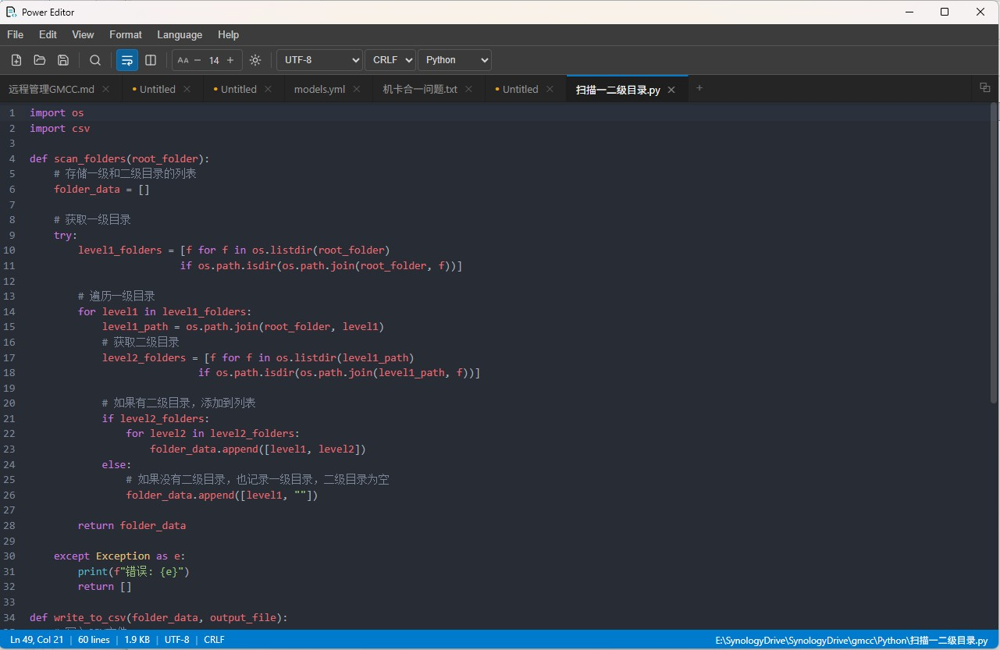

# Power Editor

**中文 | [English](README.md)**

> **免费开源的跨平台大文件文本编辑器。** 秒开 100MB、1GB 乃至数 GB 的文本文件，不卡顿，不崩溃。



---

## 为什么选择 Power Editor？

绝大多数文本编辑器在面对几百兆的日志文件、CSV 导出或源码归档包时，要么极度缓慢，要么直接崩溃。Power Editor 专为此场景打造，使用原生 Rust 后端流式加载并索引内容，让编辑器始终保持流畅。

**适用人群**

- 开发者查看大型构建日志、服务器日志或数据导出文件
- 数据工程师打开数百 MB 的 CSV / TSV / JSON 文件
- 系统管理员编辑大型配置文件或 grep 输出结果
- 任何曾见过「文件过大」提示或编辑器卡死的用户

---

## 核心功能

### ⚡ 任意大小文件，秒级打开
100MB+ 文件不到一秒即可打开。编辑器采用渐进式流式加载，内容在后台持续载入的同时，你即可立刻开始阅读和编辑。无需等待，不占用大量内存。

### 🔍 全文闪电搜索
支持正则表达式的查找替换，100MB 文本的全文搜索在 2 秒内完成。搜索结果按行号列出，点击即可跳转到对应位置。

### 🎨 语法高亮
兼容广泛使用的 **UltraEdit `.uew` Wordfile** 格式，内置 C++、Python、Rust 语法高亮。通过 **语言 → 导入 Wordfile** 可在运行时即时加载任意 `.uew` 文件，无需重启。

### 🌐 多编码支持——一键修复乱码
打开文件时自动检测编码（UTF-8、GBK、Big5、Shift_JIS 等数十种）。若文件出现乱码，点击状态栏底部的编码标签，以正确编码重新打开，立刻还原正常显示。

### ↕ 换行符转换
一键在 LF（Unix）与 CRLF（Windows）之间切换，跨系统共享文件时不再烦恼。

### ▦ 列模式编辑（Alt + 拖动）
跨多行选取矩形文本块，非常适合编辑定宽数据、日志列或对齐代码。

### 🗂 多标签编辑
同时打开多个文件并行编辑。右键标签可快速执行：另存为、重命名、复制路径、关闭其它标签。

### 🔔 外部文件修改检测
当其他程序修改了你已打开的文件，Power Editor 会立即感知。若无未保存改动则静默重载；若有本地编辑则弹出确认——重新加载或保留本地改动，由你决定。

### 🌙 深色 / 浅色主题
在视图菜单或工具栏中一键切换主题风格。

### ⌨ 完全自定义快捷键
打开 **文件 → 设置 → 快捷键设置**，重新映射任意操作，检测冲突，或恢复默认值。所有自定义配置跨会话持久保存。

### 📌 收藏夹与最近文件
将常用文件固定到收藏夹，一键直达。最近文件记录完整打开历史。

### 💾 会话恢复
重新打开 Power Editor，上次的标签页自动恢复，继续从你离开的地方开始工作。

---

## 下载

前往 [**Releases 页面**](../../releases) 下载对应平台的最新安装包：

| 平台 | 文件 |
|------|------|
| Windows | `Power.Editor_x.y.z_x64-setup.exe` |
| macOS | `Power.Editor_x.y.z_universal.dmg` |
| Linux（x86_64 / ARM64） | `.deb` / `.AppImage` |

---

## 快速上手

1. **安装**：下载并运行对应平台的安装包（见上方下载）。
2. **打开文件**：将文件拖入窗口、使用 **文件 → 打开**，或在 Windows 资源管理器中右键 → *用 Power Editor 打开*。
3. **搜索**：`Ctrl+F` 查找，`Ctrl+H` 查找替换。
4. **切换编码**：点击底部状态栏中的编码标签。
5. **添加语法高亮**：**语言 → 导入 Wordfile (.uew)…** 并选择你的语法文件。

---

## 添加语法高亮

Power Editor 使用与 UltraEdit 相同的 **Wordfile** 格式，现有 `.uew` 文件开箱即用。

**方式一——运行时导入（无需重启）：**
前往 **语言 → 导入 Wordfile (.uew)…**，选择文件后立即生效。

**方式二——随应用打包（开发者）：**
将 `.uew` 文件放入项目根目录 `wordfiles/`，重新构建后随应用启动加载。

格式参考：[UltraEdit Wordfile 格式说明](https://www.ultraedit.com/wiki/Wordfiles)

---

## 已知问题

- **Windows 中文标点需按两次（已有临时补丁）**：Chromium 149+ 在 Windows 上存在一个影响中文 IME 标点输入的 bug，导致每隔一次才出现字符。Power Editor 已内置自动绕过方案，无需任何手动操作。上游浏览器修复已合并，将随后续 WebView2 更新推送。详见 [docs/known-issues-chinese-ime-punctuation.md](docs/known-issues-chinese-ime-punctuation.md)。

---

## 从源码构建

```bash
# 安装依赖
npm install

# 开发模式（热重载）
npm run tauri:dev

# 生产构建
npm run tauri:build

# Linux / 银河麒麟（Docker，ARM64 + x86_64）
./scripts/build-linux-docker.sh
```

> Linux 及银河麒麟系统详细构建说明：[docs/build-linux-kylin.md](docs/build-linux-kylin.md)

---

## 开源协议

MIT
